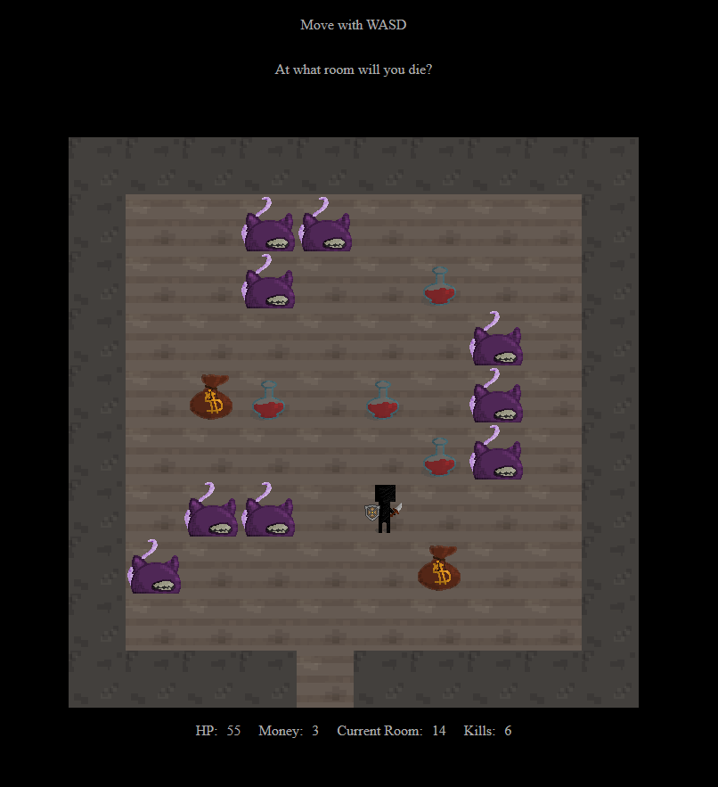

# HTML Canvas Game

HTML game that spawns random monsters, hp potions and coins in each room.
The monster count increases based on the room number, which means the difficulty lies in getting to the room with the highest number alive.

This is a web version of the CLI based game: https://github.com/AlexisCesar/cli-based-game

🕹 You can play it on: https://alexiscesar.github.io/html-canvas-game/

Preview:

